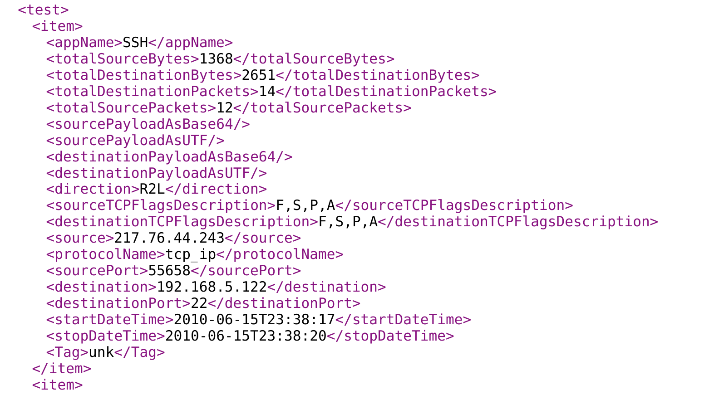

# First challenge
Ce challenge comprend deux fichiers qui concernent les protocoles (applicationName) HTTPWeb et SSH :
- un fichier de test HTTPweb, contenant des flux étiquetés (champ 'Tag') 'unk' (unkown).
- un fichier de test SSH, contenant des flux étiquetés (champ 'Tag') 'unk' (unkown).
Extrait d'un ficheir test :

Extrait du fichier SSH test :


Le défi consiste à apprendre un classifieur par protocole d'application (HTTPWeb et SSH) pour classer des flows listés dans les fichiers de test correspondants. Pour l'apprentissage vous utiliserez l'intégralité des fichiers de flows labellisés 'normal' ou 'attack' (champ tag) à votre disposition.

## Les résultats produits seront présentés sous la forme d'un fichier JSON au format suivant :

```python
import json
res=dict()

# On suppose que le fichier test contient 7 flows
predictions=['Normal','Normal','Attack','Attack','Normal','Normal','Normal'] # Liste de 7 prédictions de la variable de classe (0:Normal, 1:Attack)
probs=[[.2,.8],[.3,.7],[.8,.2],[.75,.25],[.1,.9],[.7,.3],[.4,.6]] # 7  paires de probabilités  [proba_classe_Attack, proba_classe_Normal] associées aux prédictions pour les classes Normal er Attack respectivement.

res['preds']=list(predictions) # list of predicted labels
res['probs']=list(probs)     # list of probas/scores (probas of attack (class 1))
                                            
res['names']=['NAME1','NAME2']     # list of team member name(s )
res['method']=METHOD_NAME    # methode name
res['appName']=APP_NAME    # "SSH" ou "HTTPWeb"
res['version'] = VERSION    # submission version number
f = open("<NAME1>_<NAMES2>_<APP_NAME>_<VERSION>"+".res","w") # VERSION = 1, 2 ou 3
f.write(json.dumps(res))
f.close()
```

Un exemple de fichier résultat est donné dans le répertoire contenant les fichiers de test.

## ATTENTION  :
- dans ce fichier résultats respecter l'ordre des flows du fichier de test. Vérifier que vous avez autant de couple de probas/prédictions dans votre fichier résultat qu'il y a de flows dans le fichier de test ! 
- L'ordre des prédictions/probas fournis dans les fichiers résultats doit impérativement être le même que l'ordre des flows dans les fichiers de test.
- L'ordre dans les couples de probabilités doit être impérativement respecté et conforme à [proba_classe_Attack, proba_classe_Normal].