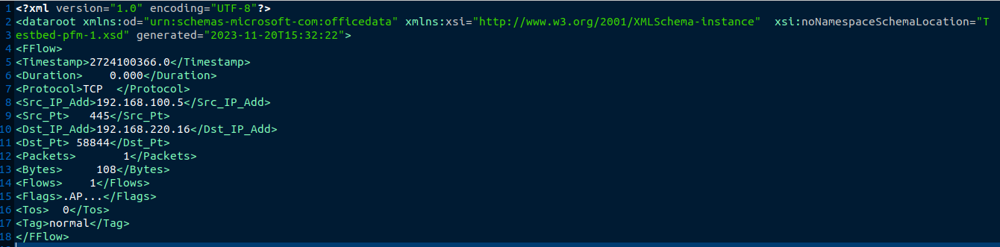

# Second challenge
Ce challenge comprend deux fichiers qui concernent les protocoles (applicationName) HTTPWeb et SSH :
- un fichier XML Train, contenant des flux étiquetés par le champ 'Tag' prenant les valeurs dans ['attacker', 'normal', victim'].
- un fichier XML Test, contenant des flux étiquetés par le champ 'Tag' prenant la valeur  'Unk' (unkown).

Extrait du fichier "Train" :


Le défi 2 consiste à apprendre un classifieur unique (quelles que soient les applications) pour classer des flows listés dans les fichiers de test correspondants. Pour l'apprentissage vous utiliserez l'intégralité des fichiers de flows labellisés 'Attack, 'Normal' ou ''Victim' (champ 'Tag') à votre disposition.

## Les résultats produits seront présentés sous la forme d'un fichier JSON au format suivant :

```python
import json
res=dict()

# On suppose que le fichier test contient 7 flows
predictions=['normal','normal','attacker','victim','normal','normal','normal'] # Liste de 7 prédictions de la variable de classe (0:Normal, 1:Attack)
probs=[[.2,.4,.4],[.3,.5,.2],[.6,.2, .2],[.7,.25,.05],[.1,.1,.9],[.2,.5,.3],[.1,.3,.6]] # 7  triplets de probabilités  [proba_classe_attacker, proba_classe_normal, proba_classe_victim] associées aux prédictions pour les classes 'attacker', 'normal' et 'victim' respectivement.

res['preds']=list(predictions) # list of predicted labels
res['probs']=list(probs)     # list of probas/scores (probas of attack (class 1))
                                            
res['names']=['NAME1','NAME2']     # list of team member name(s ) at most 2
res['method']=METHOD_NAME    # methode name
res['version'] = VERSION    # submission version number
f = open("<NAME1>_<NAMES2>_<VERSION>"+".res","w") # VERSION = 1, 2 ou 3
#ou f = open("<NAME1>_<VERSION>"+".res","w") # VERSION = 1, 2 ou 3
f.write(json.dumps(res))
f.close()
```

## ATTENTION  : 

- Dans ce fichier résultats respecter l'ordre des flows du fichier de test. Vérifier que vous avez autant de triplets de probas/prédictions dans votre fichier résultat qu'il y a de flows dans le fichier de test ! 
- L'ordre des prédictions fournis dans les fichiers résultats doit impérativement être le même que l'ordre des flows dans les fichiers de test.
- l'ordre des probabilités dans les triplets doit être impérativement [proba_classe_Attack, proba_classe_Normal, proba_classe_Victim]
- Si vous avez des difficultés pour ;chargfer en mémoire des gros fichiers XML, pensez à les "parser" sur disque, soit en développant votre propre petit parser ad hoc, soit en utilisant des solutions sur étagère du type BigXML (https://bigxml.rogdham.net/)